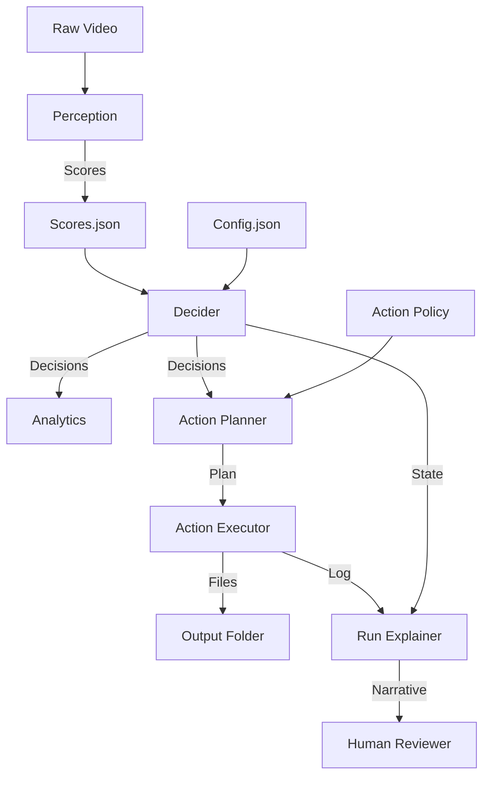

# Decision Intelligence Architecture

> **"I designed and implemented a 7-layer decision intelligence pipeline with explainability, auditability, and policy-driven execution. The system separates perception, scoring, judgment, analytics, planning, execution, and explanation—enabling safe and interpretable AI decisions at scale."**

This document outlines the architecture of the AI Video Editor, designed as a reference implementation for high-trust automated decision systems.

## The 7-Layer Model

The system operates in a strict unidirectional pipeline, ensuring decoupling between *understanding* the world and *acting* on it.

### 1. Perception Layer (Signals)
*   **Responsibility**: Converts raw data (video/audio) into quantitative signals.
*   **Components**:
    *   `motion_filter.py`: Extracts visual change metrics.
    *   `face_filter.py`: Detects presence of human subjects.
    *   `vad_filter.py`: measures speech activity.
*   **Output**: Raw normalized scores (0.0 - 1.0).

### 2. Scoring Layer (Normalization)
*   **Responsibility**: Normalizes and structures raw signals into a consistent schema.
*   **Components**: Integrated within filter modules, saving to `score_keeper.py` / `scores.json`.
*   **Output**: `processing/scores.json` (The "Ground Truth" of perception).

### 3. Judgment Layer (The Decider)
*   **Responsibility**: Pure logic. Aggregates scores, applies weights, and renders a verdict (`keep` vs `discard`) based on a single source of truth.
*   **Components**: `decider.py`.
*   **Output**: `processing/decisions.json`.
*   **Key Trait**: Deterministic and Configurable (`config.json`).

### 4. Analytics Layer (Self-Awareness)
*   **Responsibility**: monitoring the system's own behavior. Analyzes acceptance rates and rejection reasons *before* action.
*   **Components**: `decision_analytics.py`.
*   **Output**: `processing/run_summary.json` (Audit Log).

### 5. Policy & Planning Layer (Safety)
*   **Responsibility**: Translates abstract decisions into concrete, safe actions. Applies confidence thresholds to separate "Keep" from "Quarantine".
*   **Components**: `action_planner.py`.
*   **Output**: `processing/action_plan.json`.
*   **Key Trait**: Reversible planning; no side effects yet.

### 6. Execution Layer (Action)
*   **Responsibility**: The "Dumb Executor". Performs physical file operations (Move/Copy/Delete) strictly according to the plan.
*   **Components**: `action_executor.py`.
*   **Output**: `processing/action_log.json`, `output_clips/`.
*   **Key Trait**: No logic, just compliance.

### 7. Explanation Layer (Trust)
*   **Responsibility**: Translates system state into human-readable narratives. Answers "Why did you do that?".
*   **Components**: `run_explainer.py`.
*   **Output**: `processing/clip_explanations.json` (Per-clip justification).

## Data Flow Diagram

## Future Extensions (Phase 6+)

*   **Feedback**: Human-in-the-loop validation (`thumbs_up` / `thumbs_down`).
*   **Learning**: Automated weight adjustment based on feedback signals.
