# 🗺️ Visual System Map: AI Video Editor

> **"Understanding the Brain in 5 Charts"**

---

## 1. The High-Level Pipeline
*How raw video becomes a polished edit.*

---

## 2. The Decision Logic (The Brain)
*How the system decides "Keep" vs "Discard".*

```mermaid
flowchart TD
    subgraph SENSORS [Perception Layer]
        Visual[Motion Score]
        Face[Face Score]
        Speech[Speech Score]
    end

    subgraph LABELS [Semantic Layer]
        Regex[Hinglish/Keywords]
        LLM[Together AI]
    end

    subgraph BRAIN [The Decider]
        calc{Calculate Score}
    end

    Visual --> calc
    Face --> calc
    Speech --> calc
    Regex -->|Product/Funny/General| calc
    LLM -->|Fallback Tag| calc

    calc -->|Score >= 0.65| KEEP[✅ Keep]
    calc -->|Score < 0.65| DISCARD[❌ Discard]

    style KEEP fill:#27ae60,color:white
    style DISCARD fill:#c0392b,color:white
```

---

## 3. Semantic Tagging Flow (Hinglish Supported)
*How it understands what you say.*

---

## 4. Execution Policy
*Where do the clips go?*

---

## 5. File & Data Flow
*What files are created where?*

```mermaid
graph TD
    subgraph PROCESSING [processing/]
        V[Video Chunks]
        S[scores.json]
        T[tags.json]
        D[decisions.json]
    end

    subgraph OUTPUT [output_clips/]
        Selected[📁 selected/]
        Quarantine[📁 quarantine/]
    end

    V -->|Motion/Face/VAD| S
    V -->|Whisper/LLM| T
    S & T -->|Decider| D
    D -->|Executor| Selected & Quarantine
```

